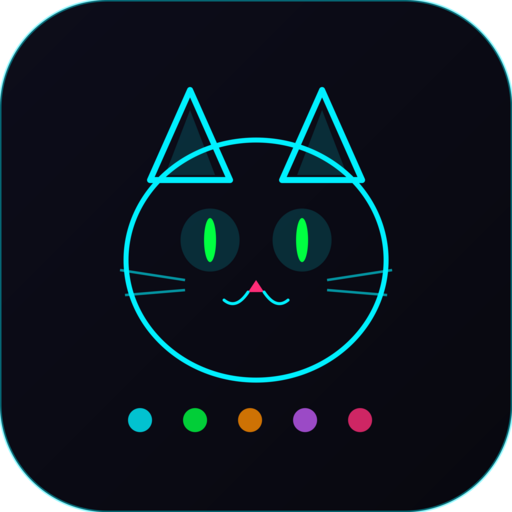
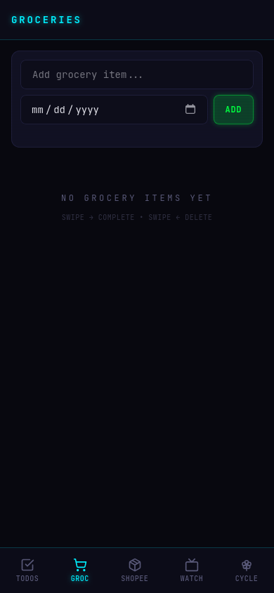
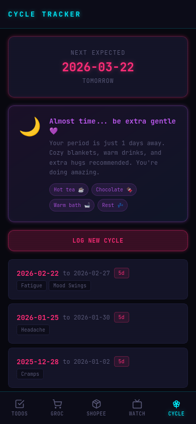

# Life Manager

<div align="center">



**A cyberpunk-themed mobile-first PWA for managing daily life.**

*Rust + Dioxus 0.7 + Tailwind CSS v4 + SQLite*

</div>

---

## Screenshots

<div align="center">
<table>
<tr>
<td align="center"><br/><b>To-Dos</b></td>
<td align="center"><br/><b>Groceries</b></td>
<td align="center"><br/><b>Shopee Pick-ups</b></td>
</tr>
<tr>
<td align="center"><br/><b>Watchlist</b></td>
<td align="center"><br/><b>Cycle Tracker + PMS Care</b></td>
<td align="center"><br/><b>PWA Icon</b></td>
</tr>
</table>
</div>

## Features

**5 modules in one app:**

- **To-Dos** — Task tracking with quick-add chips and optional due dates
- **Groceries** — Shopping list with swipe-to-complete and dynamic defaults
- **Shopee Pick-ups** — Package tracking with OCR-based code extraction from screenshots (Traditional Chinese + English)
- **Watchlist** — Movie / Series / Anime / Cartoon tracker
- **Cycle Tracker** — Period logging with symptom tracking, next-cycle prediction, and PMS care reminders (supportive messages 10 days before)

**Key capabilities:**

- Swipe right to complete, swipe left to delete
- Swipe completed items right again to save as quick-add defaults
- OCR reads Shopee screenshots: extracts product name, store location, and pickup code (supports multiple packages per screenshot)
- Tracks who completed each item via Tailscale identity
- Installable PWA with offline caching
- Self-hosted fonts, no external dependencies at runtime

## Stack

| Layer | Technology |
|-------|-----------|
| Language | Rust (2021 edition) |
| Frontend | Dioxus 0.7 (fullstack, compiles to WebAssembly) |
| Styling | Tailwind CSS v4 with custom cyberpunk theme |
| Database | SQLite with r2d2 connection pooling |
| OCR | Tesseract (chi_tra + eng) |
| Auth | Tailscale user headers |
| Deployment | Docker Compose + Tailscale sidecar |

## Quick Start

### Prerequisites

- Rust toolchain with `wasm32-unknown-unknown` target
- [Dioxus CLI](https://dioxuslabs.com/) v0.7.3+
- Node.js (for Tailwind CSS)
- Docker + Docker Compose (for deployment)

### Development

```bash
npm install
bash scripts/dev.sh
```

Opens at `http://localhost:8080`.

### Production Build & Deploy

```bash
bash scripts/deploy.sh
```

Builds Tailwind CSS, compiles the Dioxus app, packages into Docker, deploys, and verifies health.

### Other Commands

```bash
bash scripts/build.sh        # Build for production (no deploy)
bash scripts/check.sh        # Type check (cargo check)
bash scripts/screenshot.sh   # Playwright mobile screenshots of all pages
```

## Architecture

```
src/
├── models/      # Shared data structs (client + server)
├── api/         # Server functions (#[server] RPC)
├── server/      # SQLite, auth, validation (server-only)
├── components/  # Reusable UI (swipe, chips, layout, OCR)
├── pages/       # Page components (one per module)
├── route.rs     # Router config
└── main.rs      # Entry point
```

Single Rust codebase compiles to both WebAssembly (browser) and a native server binary. Models are shared across the network boundary — no duplicate type definitions.

## Documentation

Comprehensive docs in [`docs/`](./docs/):

1. [Architecture Overview](docs/01-architecture.md)
2. [The Dioxus Fullstack Model](docs/02-dioxus-fullstack.md)
3. [Data Model & Storage](docs/03-data-model.md)
4. [Components & UI Patterns](docs/04-components.md)
5. [Authentication & Security](docs/05-security.md)
6. [OCR Pipeline](docs/06-ocr-pipeline.md)
7. [Deployment & Operations](docs/07-deployment.md)
8. [Developer Guide](docs/08-developer-guide.md)

## Deployment

Runs as a Docker Compose stack with a Tailscale sidecar for secure networking:

```yaml
services:
  tailscale:  # HTTPS tunnel + user identity
  app:        # Life Manager (Dioxus server + static assets)
```

The app is only accessible via Tailscale — no public internet exposure. SQLite database persists in a Docker volume.

## License

Private project.
